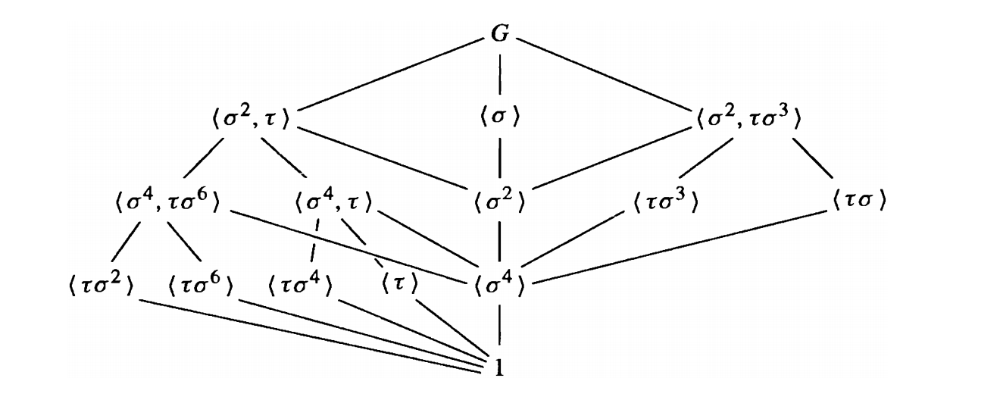

# Abstract Algebra 2024 Spring Final
## General Informations
- **Date**: 2024-06-18.
- **Time**: 9:00 - 12:00.
- **Closed book.**
- **Total points:** 100. 10 pts for each question, and 0 pts for bonus question.

**Problem 1.** Prove that, $(x,y),(2,x,y)$ are all prime ideals of $\mathbb{Z}[x,y]$, but only the latter one is maximal ideal.

**Problem 2.** Let $R$ be a ring and $I,J$ are ideals of $R$.\
(a)  Prove that $IJ$ is an ideal contained in $I\cap J$. Give an example where $IJ\not=I\cap J$.\
(b)  If $R$ is commutative with identity $1\not=0$ and $I+J=R$, prove that $IJ=I\cap J$.\
**You are not allowed to use Chinese Remainder Theorem in this question.**

**Problem 3.** Determine whether the following polynomials are irreducible in rings indicated. For these that are reducible, determine their factorization into irreducibles.\
(a)  $x^3+x+1$ in $\mathbb{Z}/3\mathbb{Z}[x]$, and $x^4+1$ in $\mathbb{Z}/5\mathbb{Z}[x]$.\
(b)  $f=x^4+4x^3+6x^2+2x+1$ and $g=\dfrac{(x+2)^p-2^p}{x}$ (here $p$ is an odd prime) in $\mathbb{Q}[x]$.

**Problem 4.** Show that $f(x)=x^3-2x-2$ is irreducible over $\mathbb{Q}$. Let $\theta$ be a root of $f(x)$, compute $(1+\theta)(1+\theta+\theta^2)$ and $\dfrac{1+\theta}{1+\theta+\theta^2}$ in $\mathbb{Q}(\theta)$.

**Problem 5.** Let $\alpha=2r-s+rs,\beta=r-2r^3s\in \mathbb{Z}D_8$. Compute $\alpha+\beta,\ \alpha\beta,\ \beta^2$.\
Note that $D_8=\{1,r,r^2,r^3,s,sr,sr^2,sr^3\}$ satisfying $r^4=s^2=1$, $sr=r^{-1}s$. $\mathbb{Z}D_8$ is the group ring.

_Note:_ $\alpha,\beta$ are not exactly the one that appeared on the exam paper. However I believe the difficulties are the same.

**Problem 6.** This problem is about the example of $\mathbb{Q}(\sqrt{2},\sqrt{3})$ we discussed extensively in class.\
(a)  Prove that $\sqrt{3}\not\in \mathbb{Q}(\sqrt 2)$. Deduce that $[\mathbb{Q}(\sqrt{2},\sqrt{3}):\mathbb{Q}]=4$.\
(b)  Prove that $\mathbb{Q}(\sqrt 2+\sqrt 3)=\mathbb{Q}(\sqrt 2,\sqrt 3)$. Find the minimal polynomial of $\sqrt 2+\sqrt 3$ over $\mathbb{Q}$.\
(c)  Is the extension $\mathbb{Q}(\sqrt{2},\sqrt{3})/\mathbb{Q}$ Galois? If yes, determine all elements in $\text{Gal}(\mathbb{Q}(\sqrt{2},\sqrt{3})/\mathbb{Q})$.

**Problem 7.** This problem discusses some properties of $\mathbb{Q}(\sqrt 2)$ and $\mathbb{Q}(\sqrt[3] 2)$.\
(a)  Determine $\text{Aut}(\mathbb{Q}(\sqrt 2))$, $\text{Aut}(\mathbb{Q}(\sqrt[3] 2))$, $\text{Aut}(\mathbb{Q}(\sqrt 2)/\mathbb{Q})$, and $\text{Aut}(\mathbb{Q}(\sqrt[3] 2)/\mathbb{Q})$.\
(b)  Is $\mathbb{Q}(\sqrt 2)/\mathbb{Q}$ Galois? If yes, find its Galois group; if no, find $x\in \mathbb{C}$ which is algebraic over $\mathbb{Q}$ such that $\mathbb{Q}(\sqrt 2, x)$ is Galois over $\mathbb{Q}$ and compute its Galois group.\
(c)  Is $\mathbb{Q}(\sqrt[3] 2)/\mathbb{Q}$ Galois? If yes, find its Galois group; if no, find $x\in \mathbb{C}$ which is algebraic over $\mathbb{Q}$ such that $\mathbb{Q}(\sqrt[3] 2, x)$ is Galois over $\mathbb{Q}$ and compute its Galois group.

**Problem 8.** Prove that, if $[F(\alpha):F]$ is odd, then $F(\alpha)=F(\alpha^2)$. 

**Problem 9.** In class, we have shown that the Galois group of $f(x)=x^5-6x+3$ is $S_5$ by showing that $f$ is irreducible and has exactly $3$ real roots and $2$ complex roots.\
(a)  Let $p$ be an odd prime. $f\in \mathbb{Z}[x]$ has degree $p$ and is irreducible. Suppose $f$ has exactly $p-2$ real roots, prove that the Galois group of $f$ is isomorphic to $S_p$.\
(b)  Let $g(x)=x^5-15x+4$. Can $g(x)$ be solved by radicals? Prove your result.

**Problem 10.** In textbook, it has been shown that the splitting field of $x^8-2$ over $\mathbb{Q}$ is $K:=\mathbb{Q}(\theta,i)$ (where $\theta=\sqrt[8]2$), and the Galois group $G:=\text{Gal}(K/\mathbb{Q})$ is isomorphic to $QD_{16}=\langle\sigma, \tau : \sigma^8=\tau^2=1, \sigma\tau=\tau\sigma^3\rangle$. The lattice of the subgroups of $G$ and subfields of $K$ containing $\mathbb{Q}$ are as follows. $\zeta=e^{\pi i/4}$.

(a) There are a missing subfield of $K$ in the lattice. What is it?\
(b) Is $K/\mathbb{Q}((1+i)\sqrt[4]2)$ and $K/\mathbb{Q}(i,\sqrt{2})$ Galois? If yes, determine their Galois groups; if no, explain why.\
(c) Is $\mathbb{Q}((1+i)\sqrt[4]2)/\mathbb{Q}$ and $\mathbb{Q}(i,\sqrt{2})/\mathbb{Q} $ Galois? If yes, determine their Galois groups; if no, explain why.\
(d) Find all elements of $G$ that fixes the composite field $\mathbb{Q}(i\sqrt[4]2)\mathbb{Q}(\sqrt{-2})$.

**Bonus.** Factoring is believed to be computationally hard in general. Yet, factoring polynomials over finite fields is surprisingly easy, owning to the elegant Berlekamp's factorization algorithm that has important applications in public key cryptography. The efficiency of this algorithm is based on the efficiency of computing greatest common divisors in $\mathbb{F}_p[x]$ by the Euclidean algorithm and on the efficiency of row-reduction matrix algorithms for solving systems of linear equations. To appreciate the beauty of this algorithm, we consider here a special cases of $p=2$ for simplicity. Let $f(x)\in \mathbb{F}_2[x]$ and suppose $f(x)=p_1^{n_1}(x)p_2^{n_2}(x)\cdots p_k^{n_k}(x)$, where $p_1(x),\cdots,p_k(x)$ are distinct monic irreducible polynomials in $\mathbb{F}_2[x]$ and $n_1,n_2,\cdots,n_k\ge 1$ are positive integers.\
(a) (Handling square factors) Prove that $D_xf$ (the derivative of $f(x)$) is a square, and $D_xf\equiv 0$ iff $f(x)$ is a square. Moreover, prove that $\gcd(f,D_xf)$ is the product of poers of the square factors of $f(x)$. [From this, we can always efficiently find out the square factors and reduce the problem into square-free factorization by considering $\dfrac{f(x)}{\gcd(f(x),D_xf)}$.]\
(b)  (Square-free factorization) Suppose $f(x)$ is square-free, i.e. $n_1=n_2=\cdots=n_k=1$, suppose $\deg f=n$, $k\ge 2$. Use the Chinese Remainder Theorem to prove that there is a polynomial $h(x)\in \mathbb{F}_2[x]$ with degree at most $n-1$ such that $h^2\equiv h\pmod f$, and such $h$ can be found by solving a system of linear equations. Prove that $f(x)=\prod_{c\in \mathbb{F}_2} \gcd(f,h(x)-c)$ and use this to factor $f(x)=x^6+x^3+x+1$ over $\mathbb{F}_2$. [From this, it is easy to see that the time complexity of this algorithm is upper bounded by $O(n^3)$, amazing!]