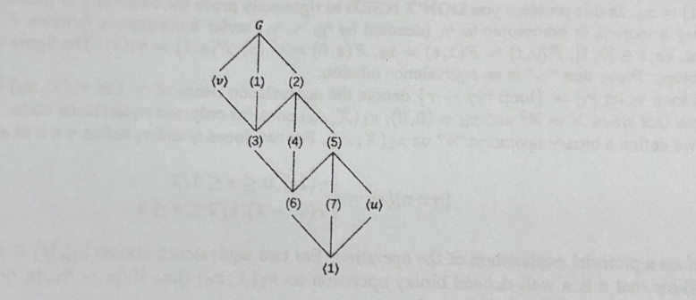
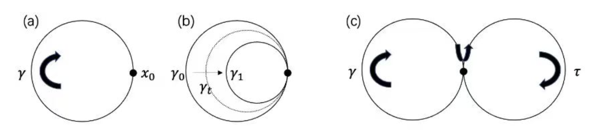

# Abstract Algebra 2025 Spring Midterm

## General Information

- **Date and Time**: 2025.4.14, 1:30-4:30 PM.
- Answer in **English only**.

Show enough details on how you derive the answers. Your solution should be well-written, neat, and organized.

**Problem 1 (10pts).** Let $\sigma,\tau\in S_7$, and $\sigma=(2~~7)(1~~3~~2~~6)(2~~4~~3~~5)$, and $\tau=(1~~2~~4)(5~~6~~7)$. Compute $\tau^3,\sigma\tau,\sigma\tau^2,\tau\sigma\tau^{-1}$. Please express the answers as products of disjoint cycles.

**Problem 2 (10pts).** Compute all conjugacy classes in $D_{16}$ and give the class equation of $D_{16}$ (Here $D_{2n}=\langle r,s\mid r^n=s^2=srsr=1\rangle$ is the dihedral group of order $2n$).

**Problem 3 (10pts)** Let $M$ and $N$ be normal subgroups of $G$ such that $G=MN$. Prove that $G/(M\cap N)=(G/M)\times (G/N)$.

**Problem 4 (10pts).**

(a) Show that $A_4$ is solvable.

(b) Show that the subgroup of a solvable group is solvable.

**Problem 5 (10pts).** Let $A\le G$. Prove that $C_G(C_G(C_G(A)))=C_G(A)$.

**Problem 6 (10pts).** Let $G=\langle u,v\mid u^2=v^8=1,vu=uv^5\rangle$ be the modular group of order $16$. Please fill the subgroup lattice of $G$, exhibiting each subgroup with at most two generators. You do not need explain your answer.

**Problem 7 (10pts)**.

(a) There are five groups of order $8$: three Abelian groups and two non-Abelian groups. Please write them down and conclude that there is no order-8 simple group.

(b) Let $G$ be a simple group. If there exists a proper subgroup $H$ with $[G:H]\le 4$, prove that $|G|\le 3$.

**Problem 8 (10pts)**. Let $H$ and $K$ be subgroups of $G$. For each $x\in G$, we define the $HK$ double coset of $x$ in $G$ to be the set $HxK=\{hxk\mid h\in H,k\in K\}$. The set of all $HK$ double cosets is denoted by $H\text{\\}G/K$. 

(a) Show that the analog of Lagrange’s theorem for double cosets is false. That is, the size of a double coset need not divide $|G|$. 

(b) Show that the set of $HK$ double cosets partitions $G$.

(c) Prove that
$$
[G:K]=\sum_{HxK\in H\text{\\}G/K}\frac{|H|}{|H\cap xKx^{-1}|}.
$$
**Problem 9 (10pts).** Given a finite set $G$ and a binary operation $\ast:G\times G\to G$, what is the fastest way to verify whether $(G,\ast)$ is a group? Surprisingly, this seemingly basic question was not fully resolved until last year by a paper “Verifying Groups in Linear Time” (FOCS’24). The key lemma is the following: *Let $S$ be a subset of $G$ such that $S\ast S=\{ab\mid a,b\in S\}=G$. If for all $a,b,c,d\in S$, $((ab)c)d=(ab)(cd)=(a(bc))d=a((bc)d)=a(b(cd))$, then $\ast$ is associative, namely $x(yz)=(xy)z$ for all $x,y,z\in G$*.

In this problem, you are asked to prove this lemma step by step.

(a) Show that $x(yz)=(xy)z$ if at least two of $x,y,z$ are in $S$.

(b) Show that $((ab)(cd))(ef)=(a((b(cd))e))f$ and $(ab)((cd)(ef))=a((b((cd)e))f)$ for all $a,b,c,d,e,f\in S$. Here the two equations are symmetrical, so you only need to prove one of them.

(c) Show that $(a((b(cd))e))f=a((b((cd)e))f)$. Deduce the lemma.

Note: If you use the result of (a) in (b) and (c), please specify $x,y,z$.

**Problem 10 (10pts).** This problem aims to find all $n$ such that every group of order $n$ is a cyclic group.

(a) Suppose there exists a prime number $p$ such that $p^2\mid n$. Construct a group of order $n$ that is not cyclic.

(b) Suppose there exist two prime numbers $p,q$ with $p\mid q-1$ and $pq\mid n$. Construct a group of order $n$ that is not cyclic. (hint: $\text{Aut}(Z_q)$ is isomorphic to $Z_{q-1}$.)

On the other hand, if $n$ does not satisfy (a) and (b), every group of order $n$ is cyclic. Here you are asked to prove a weaker statement:

(c) Suppose $n=pq$ for two prime numbers $p<q$ and $p\nmid q-1$. Show that every group of order $n$ is cyclic.

**Problem 11 (0pts, just for fun!).** In this problem we introduce the definition of the fundamental group in the algebraic topology.

Let $X\subseteq \mathbb R^2$ be a point set and $x_0\in X$ be a fixed point. A *loop* $\gamma$ in $X$ is a continuous function from $[0,1]$ to $X$ such that $\gamma(0)=\gamma(1)=x_0$. In this problem you **DON’T NEED** to rigorously prove the continuity of functions you construct.

(a) We say a loop $\gamma_0$ is homotopic to $\gamma_1$ (denoted by $\gamma_0\sim\gamma_1$) under a continuous function $F:[0,1]\times [0,1]\to X$ if $F$ satisfies that, $\forall s,t\in [0,1], F(0,t)=F(1,t)=x_0,F(s,0)=\gamma_0(s),F(s,1)=\gamma_1(s)$. The figure gives a pictorial explanation of the homotopy. Prove that “$\sim$” is an equivalence relation.

(b) For a loop $\gamma$, let $[\gamma]=\{\text{loop } \tau\mid \gamma\sim\tau\}$ denote the equivalence class of $\gamma$. Let $\pi_1(X,x_0)$ be the set of all equivalence classes. Show that when $X=\mathbb R^2$ and $x_0=(0,0)$, $\pi_1(X,x_0)$ contains only one equivalence class.

(c) Now we define a binary operation “$\circ$” on $\pi_1(X,x_0)$. For two loops $\gamma$ and $\tau$, define $\gamma\circ\tau$ as a loop such that
$$
(\gamma\circ\tau)(s)=\begin{cases}\gamma(2s),&0\le s\le \frac12\\\tau(2s-1),&\frac12\le s\le 1\end{cases}.
$$
The figure gives a pictorial explanation of the operation. For two equivalence classes $[\gamma],[\tau]\in\pi_1(X,x_0)$, $[\gamma]\circ[\tau]$ is defined as $[\gamma\circ\tau]$. Show that $\circ$ is a well-defined binary operation on $\pi_1(X,x_0)$ (i.e. if $\gamma_0\sim \gamma_1,\tau_0\sim\tau_1$, then $\gamma_0\circ\tau_0\sim\gamma_1\circ\tau_1$). Furthermore, show that $(\pi_1(X,x_0),\circ)$ is a group.

**Remark:** This group is called the fundamental group (or the first homotopy group) of the set $X$ at the base point $x_0$. It can be used to classify topological objects. For example, in (b) we see that the $\pi_1(\mathbb R^2,(0,0))$ is trivial. However, one can prove that $\pi_1(S^1,(1,0))\cong \mathbb Z$ where $S^1$ is the unit circle. As a conclusion, a plane is not “topologically equivalent” to a circle (surprisingly, this result is highly non-trivial).

FIG. 1: Illustration of loops, homotopy, and operations. (a) A loop $\gamma$ can be understood as the trajectory of a  particle, $\gamma(s)$ is the positions of the particle at time $s$. The trajectory both starts and ends at $x_0$. (b) Suppose $\gamma_0\sim \gamma_1$. Let $\gamma_t(s)=F(s,t)$. $\gamma_t$ is a loop for any $t$. As $t$ increase, $\gamma_0$ can gradually become $v_1$ via $v_t$. (c) $\gamma\circ\tau$ is the concatenation of loop $\gamma$ and loop $\tau$. We can imagine the particle follows $\gamma$ with “twice the speed” and then follows $\tau$ with “twice the speed”. 