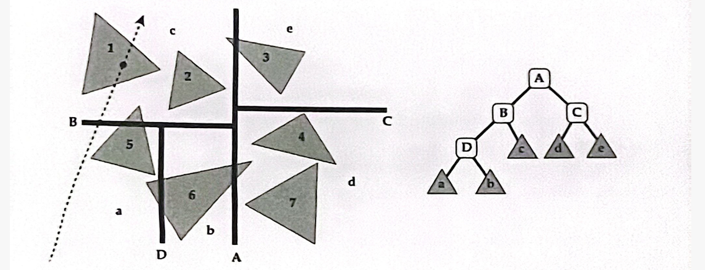

# Midterm Examination

**Advanced Computer Graphics 2025**

This exam is divided into four sections: True or False Questions, Multiple Select Questions, Short Answer Questions and Derivation Questions. The total score for this exam is 100 points.

## 1 True or False Questions (21 pts)

Each question in this section is worth 3 points. 3 points for a correct answer, 0 points for no answer, and 3 points deducted for an incorrect answer. Simply answer T/F; no explanation is required.

1. The Bézier curve always lies within the convex hull formed by its control points.
2. A mesh is a Manifold mesh if and only if each edge is incident to one or two faces.
3. Both Skew-symmetrical Matrix representation and quaternions representation are easy to invert.
4. One key idea of PointNet is to ensure that the model is permutation invariant to the input point cloud (which means changing the order of the points does not affect the output).
5. If you want to reduce artifacts during rasterization, you should sample first and then filter (filter means remove frequencies above Nyquist frequency).
6. Under the Fourier transform, multiplication in the time domain corresponds to convolution in the frequency domain.
7. Affine transformations map lines to lines, but do not preserve parallel lines.

## 2 Multiple Select Questions (48 pts)

Each question in this section worths 6 points. Select all correct answers (at least one) for full marks. Question description doesn't provide any hints on the number of correct answers.

1. Consider a cubic Bézier curve segment defined by the following four control points: $ P_{0}=(0,1) $, $ P_{1}=(\frac{4\sqrt{3}-4}{3},1) $, $ P_{2}=(1,\frac{4\sqrt{3}-4}{3}) $, $ P_{3}=(1,0) $. What are the coordinates of the midpoint of the curve?
   - (A) $ (\frac{\sqrt{2}}{3},\frac{\sqrt{2}}{3}) $
   - (B) $ (\frac{\sqrt{3}}{2},\frac{\sqrt{3}}{2}) $
   - (C) $ (\frac{1}{2},\frac{1}{2}) $
   - (D) $ (\frac{\sqrt{2}}{2},\frac{\sqrt{2}}{2}) $

2. Which of the following statements about mesh is correct?
   - (A) Loop subdivision applies different update rules for new vertices and old vertices.
   - (B) For any general mesh, Catmull-Clark subdivision keeps the number of extraordinary vertices unchanged.
   - (C) When we perform mesh simplification by collapsing an edge, the midpoint of the edge always minimize the quadric error.
   - (D) For mesh deformation energy, translation and rotation should not change the deformation energy.

3. Which of the following statements incorrectly describe the advantages and limitations of using a depth map as a 3D representation?
   - (A) Depth maps provide a complete and accurate 3D reconstruction of objects from a single view.
   - (B) Depth maps require additional camera information to obtain accurate 3D spatial information.
   - (C) The resolution of the depth map affects the quality and level of detail in the 3D representation.
   - (D) Object properties, such as reflectivity and transparency, can impact the accuracy of the depth map.

4. Which of the following rotation representations has the best space efficiency without a gimbal lock issue?
   - (A) Euler Angles
   - (B) Axis-Angle
   - (C) Rotation Matrix
   - (D) Quaternion

5. Which of the following is dataset on 3D Vision?
   - (A) ShapeNet
   - (B) PointNet
   - (C) PartNet
   - (D) ImageNet

6. Which of the following statements about antialiasing is correct?
   - (A) Jaggies phenomenon is caused by undersampling in time.
   - (B) A simple antialiased sampling method is 'sample then filter'.
   - (C) Multi-sample antialiasing approximates the effect of the 1-pixel box filter by sampling multiple adjacent pixels and average their values.
   - (D) A wider filter kernel is filtering lower frequencies signal.

7. What is the advantage of Z-buffering over the Painter's algorithm?
   - (A) Z-buffering has a lower time complexity.
   - (B) Z-buffering doesn't have unresolvable cases.
   - (C) Z-buffering is an in-place algorithm (no need for additional space).
   - (D) Z-buffering is able to sort n triangles in linear time.

8. Which of the following statements about ray-tracing is wrong?
   - (A) Moller Trumbore algorithm gives a fast solution for computing ray intersection With planar polygon.
   - (B) KD-trees, BSP-trees and Oct-trees split the scene into hierarchy rectangular cuboids to accelerate the intersection test.
   - (C) Whitted-Style ray tracing cannot generate soft shadows for objects.
   - (D) In Bounding Volume Hierarchy (BVH), an object can be contained in multiple leaf nodes in the tree.

## 3 Short Answer Questions (21 pts)

1. (8 pts) Explain how mipmap helps reduce aliasing in texture mapping. 2 to 3 sentences are sufficient.

2. (5+4+4 pts) The kd-tree shown below is used to partition the space occupied by seven triangles. The (2D) splitting planes are identified by upper-case letters, and lower-case letters are used to denote the areas of space occupied by each leaf of the kd-tree.

   

   2.1. (5 pts) Write down the list of triangles associated with each leaf node.

   2.2. (4 pts) It is obvious to us that the camera ray shot into the scene intersects triangle 1. Nevertheless, a computer program would have to do some work to figure that out. Assuming front-to-back traversal ordering (along the direction of the ray, starting from the ray's origin, visit the nodes closest to the ray first, and then visit the nodes farther away) and early termination, list the order in which the nodes of the tree are visited (use the upper and lower case labels shown in the figure on the right). Note that the nodes pruned by the bounding box intersection test should not be included in the computation.

   2.3. (4 pts) Which triangles need to be explicitly checked for intersection against the ray? You can assume that each triangle will be checked at most once.

## 4 Derivation Questions (10 pts)

Derive the required expressions or formulas, providing a clear and logical sequence of steps.

1. A quadratic Bézier curve is defined as
   $$
   B(t) = (1-t)^2 P_0 + 2(1-t)t P_1 + t^2 P_2, \quad t \in [0,1],
   $$
   Suppose all control points $ P_i $ are transformed by an affine transformation matrix M defined as
   $$
   M = \begin{bmatrix} A & b \\ 0^T & 1 \end{bmatrix},
   $$
   where A is a linear transformation (rotation, scaling, shear, etc.) and b is a translation vector.

   (a) Derive the expression of the transformed Bézier curve $ B^{\prime}(t) $ in terms of $ A $, $ b $, and the original control points $ P_i $.

   (b) Prove that affine transformations commute with Bézier interpolation, i.e. $ B^{\prime}(t) = M B(t) $ for any parameter t.