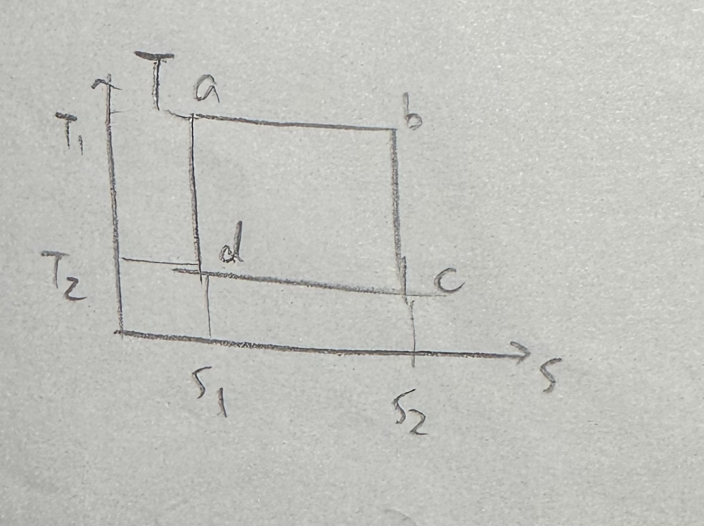

# General Physics 2024 Spring Midterm
## General Informations
- **Date**: 2024-06-16
- **Time**: 14:30-16:45
- **Calculater is allowed**
- **Closed book**
- The exam provides a table of formulas
- **Total points**: 105 (including 5 bonus points)

*side note.* All *side notes* doesn't appear on the real exam paper. However, the **Hints** do. Moreover, some problems may not be described very clearly, but it is similar to the descriptions appeared on the real exam.

## Problem 1: Short answers (20 pts)

Each question is worth 5 points. Your answer for each question should be no more than 2 sentences.

1. Any two events can always happen at the same time in some reference frame. True or False?
2. Consider a plat iron ring with inner radius $r_1$ and outer radius $r_2$ ($r_1<r_2$). Let the temperature of the ring increase. Will the inner radius $r_1$ increase or decrease?
3. Find the Van Der Valls equation in the formula sheet, and explain the two modification it does compared with the ideal gas law.
4. Consider two bubbles connecting by a solid pipe. Initially, the bubbles are at rest and in spherical shape. Bubble A has larger surface than bubble B. How will the radius of the two bubbles change after that?

## Problem 2 (5 pts)

Find the P-V diagram corresponding to the T-S diagram below.

## Problem 3 (10 pts)

The Lagrangian of a particle moving in the $xOy$ plane is

$$
L=\frac{1}{2}m(\dot{x}^2+\dot{y}^2)+\lambda x\dot{y}-\frac{1}{2}k(x^2+y^2)
$$

Here $k,\lambda$ are constants, and there is no other constraints exerted on the particle.

1. Find the generalized momentum $p_x,p_y$.
2. Find the Hamiltonian $H$ of the system.
3. What is the force $\mathbf{F}$ exerted on the particle, if using a Newton mechanics perspective?

## Problem 4 (5 pts)

The Bose distribution is given by

$$
n_i=\frac{g_i}{e^{(\epsilon_i-\mu)/kT}-1}.
$$

BEC is a phenomenon that when temperature is low enough, there will be a finite number of particles that occupy onto the lowest energy state (ground state). Explain why BEC may happen in some circumstances, and give the condition when it can't happen.

## Problem 5 (10 pts)

Consider $N$ particles in a $L\times L\times L$ box. Due to strong interactions between the particle and the box, the energy of each particle becomes

$$
E_k=\alpha(|p_x|+|p_y|+|p_z|)
$$

Meanwhile, the relation $p_i=mv_i$ still holds ($i=x,y,z$). Moreover, you can still ignore the interaction between particles, and you can assume that the particles' energy doesn't depend on the position.

1. Using the Maxwell-Boltzman distribution, find the probability distribution for the particle in the phase space. More specifically, you should find a probability distribution $P(x,y,z,v_x,v_y,v_z)$.
2. Find the rms (root mean square) velocity of the particle. Also find the heat capacity of the whole system.
3. Calculate the pressure exert on one face of the box.

## Problem 6 (10 pts)

1. Assume the Clausius representation of the second law of the thermodynamics: the heat conduction from high temperature to low temperature is not reversible. Use this to prove that any heat engine can't have an efficiency higher than the Carnot engine.

2. Prove the Clausius theorem:

$$
\oint \frac{dQ}{T}\le 0
$$

## Problem 7 (10 pts)

Consider a mixture of mono-atomic ideal gas and di-atomic ideal gas. The number of mono-atomic gas is $n_1$, and the number of di-atomic gas is $n_2$. If the adiabatic process  of the mixture is given by

$$
pV^{\frac{10}{7}}=\text{Const}
$$

Find the ratio $\frac{n_1}{n_2}$.

## Problem 8 (5 pts)

Consider three reference frame $S,S',S''$: With respect to $S$, $S'$ move with velocity $v$ along $x$. With respect to $S'$, $S''$ move with velocity $v$ along $y'$. In $S$ frame, what does $x''$ axis look like? Is it a straight line or not, and if it is, find the slope of the line.

## Problem 9 (5 pts)

Consider the Compton scattering problem. A photon with energy $E_0$ hit an electron at rest. The rest mess of the electron is $m_e$. After the collision, the photon is scattered with an angle $\theta$. (i.e. The angle between the new velocity and the old velocity of the photon is $\theta$.) Find the energy $E$ of the photon after the collision.

## Problem 10 (10 pts)

Consider a two energy system with $N\gg 1$ distiguishable molecules. The two energy levels different by $\epsilon$. Assume that there is $N_1$ particles at the high energy level.

The two energy system connects with a huge heat reservoir at temperature $T$.

1. Find the entropy of the particle system.
2. If a particle moves from the low energy level to the high energy level, find the change of the entropy of the particle system and the heat reservoir.
3. Find the number of particles at the two energy levels when the system reaches the thermal equilibrium.

## Problem 11 (10 pts)

Consider the Gibbs entropy definition:

$$
S=-k\sum_{i=1}^\Omega p_i\log p_i
$$

where $\Omega$ represents the total number of microstates, and $p_i$ is the probability of the $i$-th microstate. Furthermore, let $\epsilon_i$ be the energy of the $i$-th microstate.

1. Gibbs claims that when the total energy $E$ is fixed, the equilibrium probability distribution maximizes the entropy. Use this to find the probability distribution of the microstates. You may include two Lagrange multipliers.
2. Use the fact that 

    $$
    \left(\frac{\partial S}{\partial E}\right)_{dW=0} = \frac{1}{T}
    $$

    to find the two Lagrange multipliers.

## Problem 12 (Bonus problem, 5 pts)

Consider a race walk in special relativity. The rule of race walk says that at any time, there must be at least one foot on the ground. Now we extend this rule: the critic may move in any speed with respect to the athlete, and the rule always should hold. 

Using this assumption, find the maximum speed of the athlete.
