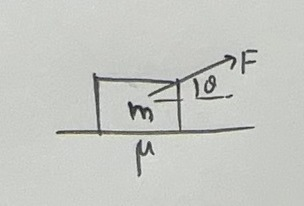
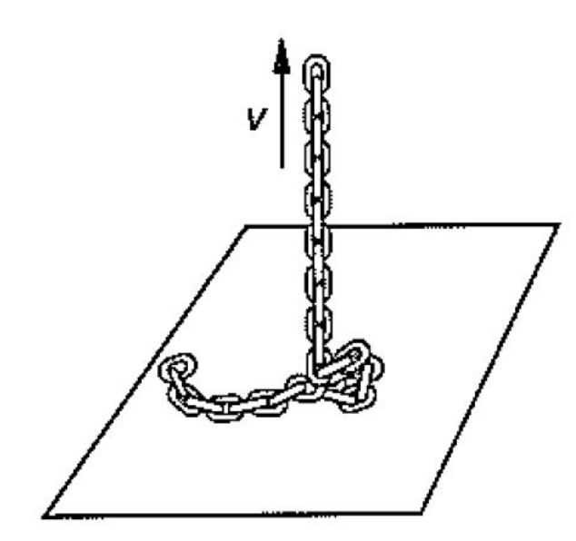
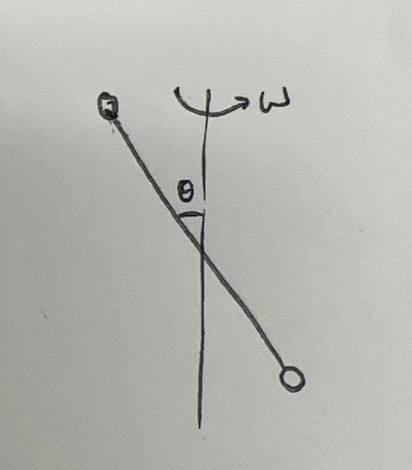
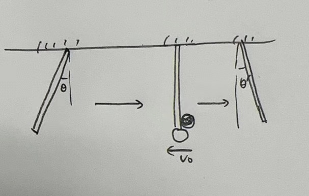
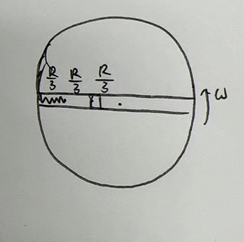
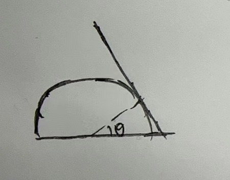
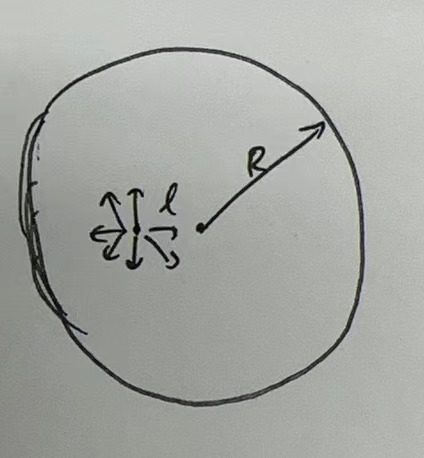

# General Physics 2024 Spring Midterm
## General Informations
- **Date**: 2024-04-22
- **Time**: 9:50-12:20
- **Calculater is allowed**
- **Closed book**
- **Total points**: 110 (including 10 bonus points)

*side note.* All *side notes* doesn't appear on the real exam paper. However, the **Hints** do. Moreover, some problems may not be described very clearly, but it is similar to the descriptions appeared on the real exam.

## Problem 1 (5 pts)
A ball does circular motion on a horizontal frictionless table. The radius of the circle is $r$. The ball is attached to a rope, which pass through a hole (size neligable) in the center of the table. The rope is pulled down with a force $F$. Now, the force is gently changed, so that the ball keeps doing approximate circular motion and the force is always perpendicular to the velocity of the ball. When the radius becomes $2r$:

(A) The kinetic energy of the ball increases.

(B) The kinetic energy of the ball decreases.

(C) The kinetic energy of the ball remains the same.

(D) None of the above.

## Problem 2 (5 pts)
A string with length $l$ and mass $m$ is attached between two fixed points, and the tension on the string is $T$. What are the possible frequencies of the string?

(A) $\frac{1}{2}\sqrt{\frac{T}{ml}}$

(B) $\sqrt{\frac{T}{ml}}$

(C) $\frac{5}{2}\sqrt{\frac{T}{ml}}$

(D) $5\sqrt{\frac{T}{ml}}$

*side note:* In the original problem, the numerical values are given. But I can't remember them.

## Problem 3 (10 pts)
A block with mass $m$ is placed on table, and a force $F$ is exerted on the block, with angle $\theta$. The coefficient of kinetic friction between the block and the table is $\mu$. Find the angle $\theta$ so that the minimal force in order to let the block move is exerted is minimized.

## Problem 4 (10 pts)
A chain is pulled up by the force $F$ at a constant speed $v$. Suppose that the mass per unit length is $\mu$, find $F$.

*side note:* this problem comes from homework.

## Problem 5 (10 pts)
A car moves at speed $v$ to a wall. The car emits a sound with frequency $f_0$. The sound reflects on the wall and comes back to the car. Assuming that the speed of sound is $c$, what is the frequency of the sound that the car receives?

## Problem 6 (10 pts)

Two balls with mass $m$, radius $r$ have a elastic collision. Before the collision, the left ball has velocity $v_0$ and the right ball is at rest. Find the energy loss during the process.

**Hint**. You can treat the collision as two processes: firstly, the balls have a 2-D collision; then the second ball collides with the string so that the radial component of the velocity is removed.

## Problem 7 (10 pts)
A system is rotating around the axis, and the angular velocity is $\omega$. The length of the stick is $2r$, and the mass of the two balls are both $m$.

(a) If the stick is light, find the angular momentum and the kinetic energy of the system.

(b) If the stick has mass $M$, find the angular momentum and the kinetic energy of the system. What is the required torque to keep the system rotating at a constant angular velocity?

## Problem 8 (10 pts)

A stick with mass $M$ and length $L$ is hang on a fixed point. The initial angle is $\theta \ll 1$. Now, the stick is released. When it reaches vertical, a ball with mass $m$ and vertial velocity $v_0$ hits the stick. The ball stickes on the stick after the collision. The stick still moves right after the collision.

(a) Find the final angle $\theta'$ of the stick.

(b) Find the new ocsillating period of the system.

## Problem 9 (15 pts)

A rotating disk with radius $R$ and angular velocity $\omega$ is fixed on a horizontal table. There is a frictionless tunnel on one of the diameter. A mass $m$ is released without initial velocity $\frac{R}{3}$ from the center. Moreover, there is a spring with force constant $k$ at the left-side. The spring's free length is $\frac{R}{3}$.

(a) Find the minimal force constant $k_m$ so that the mass can't reach the end of the tunnel, and assume that $k=k_m$ in the following problems.

(b) Does the mass have a harmonic oscillation? If so, find the period.

(c) Find the maximal supporting force exerted on the mass.

**Hint**. Consider all directions of the supporting forces.

## Problem 10 (10 pts)
A stick of mass $m$ and length $2r$ relies on a semi-circle with mass $m$ and radius $r$. They are all put on a frictionless table. Initially, the angle shown in the figure is $\theta=30\degree$. The system is released. Find the velocity of the semi-circle when the angle becomes $60\degree$.

## Problem 11 (10 pts)

Consider droping a ball from a high height $h=90\text{ m}$. Since the Earth is rotating with angular velocity $\omega = 7\times 10^{-5}\text{  rad/s}$, the ball will have a horizontal shift when it reaches the ground. Suppose the experiment is done at latitude $\phi = 45\degree$, the radius of the Earth is $R=6.4\times 10^6\text{ m}$ and the gravity accelaration is $g=10\text{ m/s}^2$. Find the horizontal shift $x_0$.

## Problem 12 (Bonus problem, 10 pts)

A light source is placed in a perfect absorbing sphere with radius $R$, its offset from the center is $l$. The light source emits $n$ photons per unit time. Each photon can be regarded as having momentum $p_0$, and the light source emits photons isotropically. You can assume that all the momentum is absorbed by the sphere. 

(a) If the light source and the sphere are both released immediately when the light is turned on, describe the motion of the two objects.

(b) If the two objects are first fixed for some time, then the light is turned on, describe the motion of the two objects.

