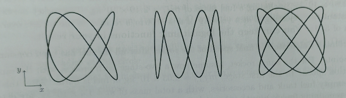
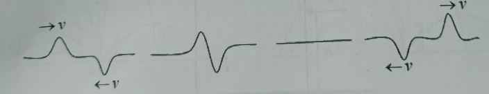
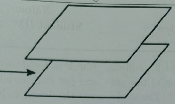
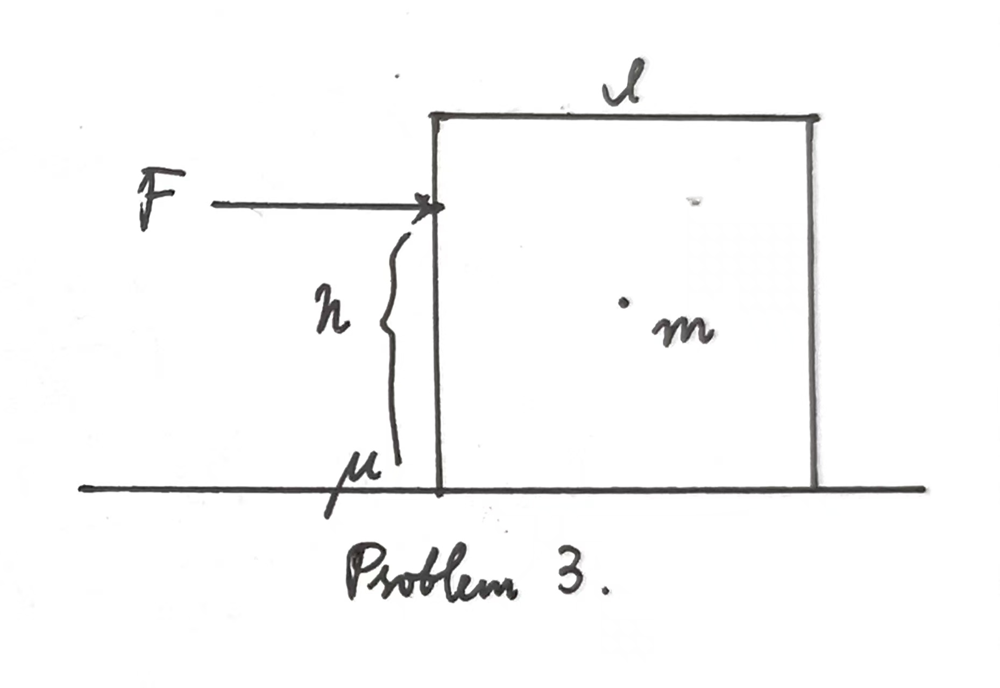
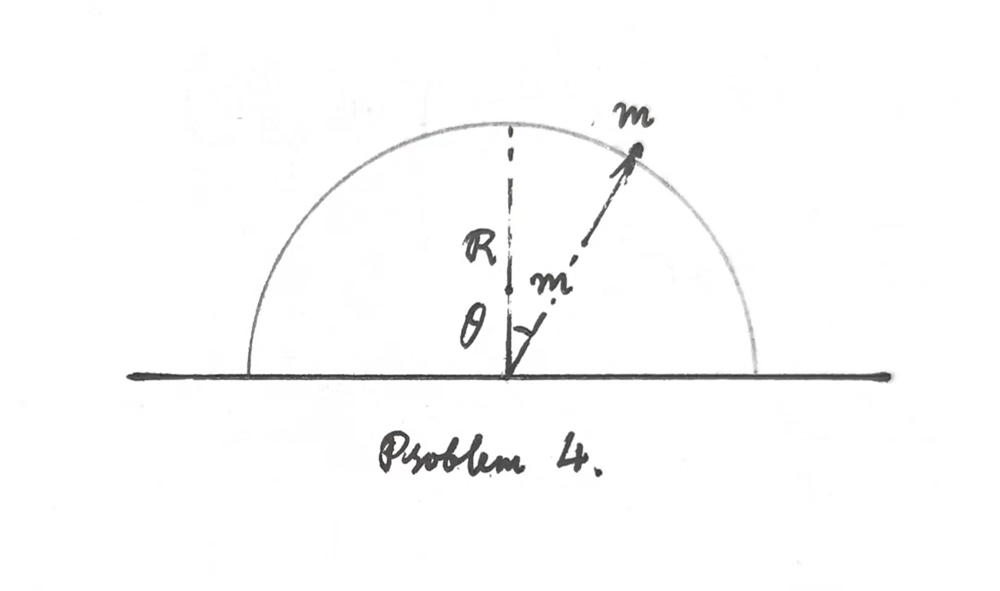
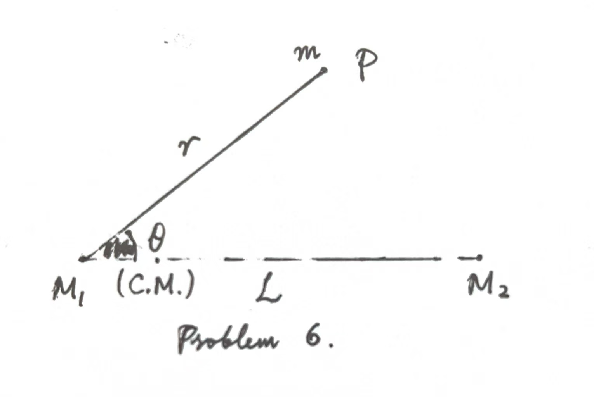
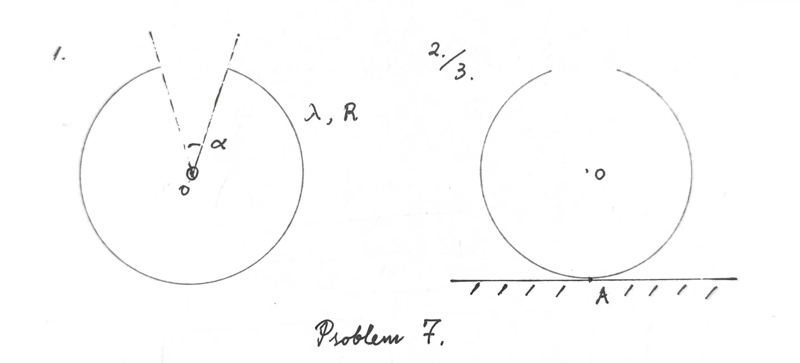
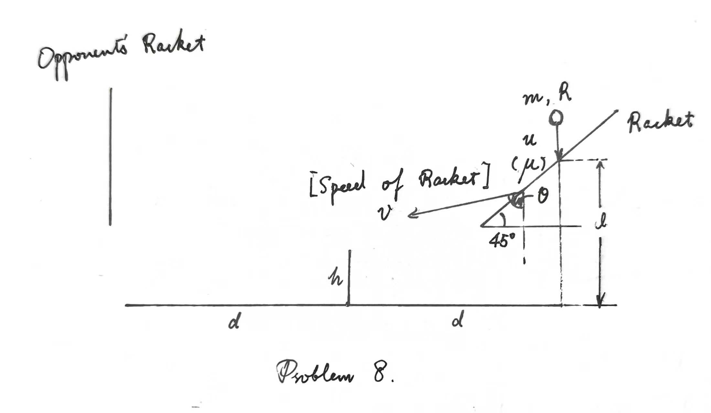
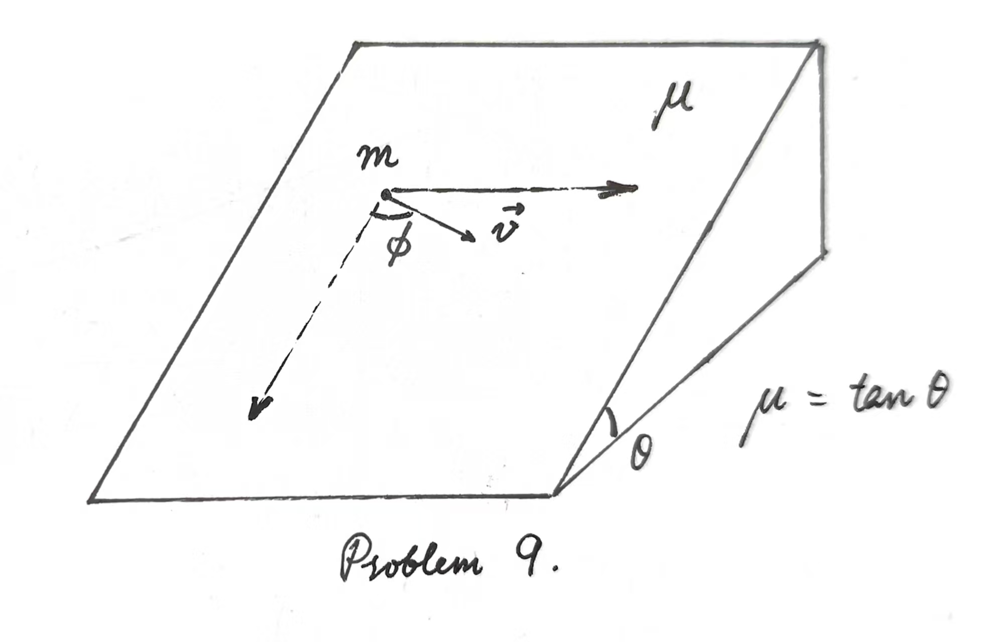

# General Physics: 2025 Spring Midterm

- **Time Limit**: $120$ minutes.
- The total score is $110$ points, including $10$ bonus points.

## Problem 1 ($5+5+5+5=20$ pts)

1. Write down the frequency ratio $\omega_x:\omega_y$ for the following Lissajous curves.
    
2. As shown in the figure, suppose two people hold the ends of a rope and create two wave packets with inverse shape traveling against each other. The wave packets will meet somewhere between the rope and due to the superposition of reverse phase will finally cancel each other resulting in a flat string as shown in the third figure. But a moment later, the two wave packets will appear again and travel along the original direction. Describe this phenomenon qualitatively, especially from the energy point of view, i.e., when the wave packets disappear, where does the energy go?
    
3. Use the wave equation to find the speed of a wave given in terms of the general function $h(x,t)$:
    $$h(x,t)=(4.00\text{ mm})\cos[(30\text{ m}^{-1})x+(6.0\text{ s}^{-1})t].$$
4. As shown in the figure, when we blow between two parallel sheets of paper, these two sheets of paper will be closer to each other. Give a simple explanation for this phenomenon.
    

## Problem 2 ($5+5=10$ pts)

Consider a rocket that starts from rest in the empty space. Initially, the rocket has a total mass of $m_{r,i}=2.81\times 10^7\text{ kg}$, including a fuel mass of $m_{f,i}=2.46\times 10^7\text{ kg}$. The rocket burns its fuel at a constant rate, ejecting it at a velocity of $u=3000\text{ m/s}$ relative to the rocket, over a total duration of $510\text{ s}$. **You can keep the logarithmic functions in your result.**

1. Calculate the final speed of the rocket after all the fuel has been consumed.
2. For the same rocket, assume now a two-stage burn process with the same fuel ejection speed. In the first stage, $m_{f,1,i}=2.03\times 10^7\text{ kg}$ of fuel is burnt. After this stage, the empty fuel tank and accessories, with a total mass of $m=1.4\times 10^6\text{ kg}$, are detached. The remaining fuel is burnt in the second stage. Determine the final velocity of the rocket after all the fuel has been burnt.

## Problem 3 ($10$ pts)

As shown in the figure, a uniformly distributed cubic with side length $l$ and mass $m$ is resting on a horizontal surface with coefficient of friction $\mu$. A horizontal force is applied to one side of the block at a point $h$ above the ground. When the magnitude of this force $F$ gradually increases from zero, the block may either slide or begin to rotate. Determine the condition under which the given parameters will cause the block to slide first, and the conditions that will cause it to rotate first.

## Problem 4 ($5+5=10$ pts)

As shown in the figure, a particle of mass $m$ is initially placed at rest at the top of the semicylinder of radius $R$ and mass $m$. After a slight perturbation, it begins to slide downward. Assuming no fiction between the particle and the semicylinder, determine the angle $\theta$ at which the particle loses contact with the semicylinder in the following two cases:
1.  The semicylinder is fixed on the horizontal surface.
2. The semicylinder is free to move frictionlessly on the horizontal surface.

## Problem 5 ($5+5+5=15$ pts)

A coordinate system is set up in the vertical plane as shown in the figure. Many particles are simultaneously projected from the origin $O$ with the same initial speed $v_0$ in all possible directions $\theta\in (0,\pi)$.
1. Prove that at any time $t$, all the particles lie on the same circle. Determine the center and radius of this circle.
2. Prove that the highest points of their trajectories lie on the same ellipse. Provide the equation of this ellipse.
3. Given a horizontal coordinate $x$, let $y_m(x)$ denote the maximum vertical height at $x$ among all trajectories. The curve formed by all such points $(x,y_m)$ is called the **envelope**. Find the equation of this envelope.

## Problem 6 ($5+5=10$ pts)

As shown in the figure, consider a satellite of mass $m$ moves under the gravitational influence of $2$ much larger masses: the earth ($M_1$) and the moon ($M_2$), with $M_1\gg M_2\gg m$. Suppose the distance between the earth and the moon is $L$. There exists a point at a nonzero angle $\theta$ where the satellite can remain stationary relative to the earth and the moon.

1. Determine the distance $r$ to the earth and angle $\theta$ of this position.
2. Suppose the satellite is returning to Earth along the straight line pointing towards the earth in the rotating reference frame with a uniform speed $u$. Find the thrust it should exert on itself at the beginning. (You can treat $r$ and $\theta$ as known quantities, so even if you haven't worked out the first problem, you can still attempt this one.)

## Problem 7 ($5+5+5=15$ pts)

As shown in the figure, we have a notched ring with the angle of noteh being $\alpha$. Suppose that the density of the ring is $\lambda$, the radius of ring is $R$, the sticks in the ring are massless. Compute the oscillation period of this notched ring in the following cases:
1. The ring is suspended by a thin thread at its center, oriented vertically with the notch facing upward. Compute the oscillation period $T_1$ for this case.
2. Now, the ring rests upright on a horizontal surface, with the notch facing upward. Suppose that the oscillation period is $T_2$ in this case, compare $T_1$ with $T_2$.
3. Compute the oscillation period $T_2$.

## Problem 8 ($5+5=10$ pts)

Guoding is fond of playing ping-pong and wishes to explore the physics behind the game to improve his skills. To create a simplified model of ping-pong, consider the racket as a flat surface with a friction coefficient $\mu$ and the ping-pong ball as a spherical shell with mass $m$ and radius $R$.

1. Guoding excels at chopping. As shown in the figure, when executing a chop, he holds the racket at a $45^\circ$ angle and strikes the ball with constant velocity $u$ while maintaining a fixed racket angle $\theta$. The collision can be modeled as elastic. The instant before impact, the ball falls vertically with speed $u$ and no spin. Determine the post-impact velocity and angular velocity of the ball.
2. Assume the ping-pong table is frictionless. Given net height $h$ and horizontal distance from impact point to net $d$, find the range of valid impact heights $l$ ensuring the ball bounces on the opponent's side.

## Problem 9 (Bonus, $10$ pts)

On a slope with a friction coefficient of $\mu$ and an angle of inclination of $\theta\in (0,\dfrac{\pi}{2})$ with the ground, there is a particle of mass $m$. Suppose $\mu=\tan \theta$. This particle initially moves on the inclined plane with an initial velocity $v_0$ parallel to the ground. When the particle reaches the state indicated in the figure ($\phi\in (0,\dfrac{\pi}{2})$), find the relationship between $\phi$ and $v$.

