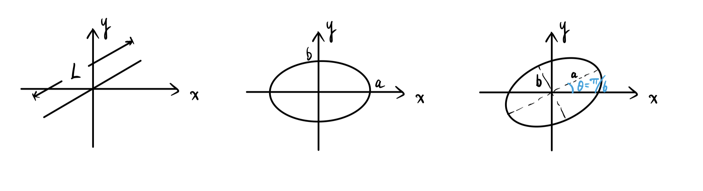
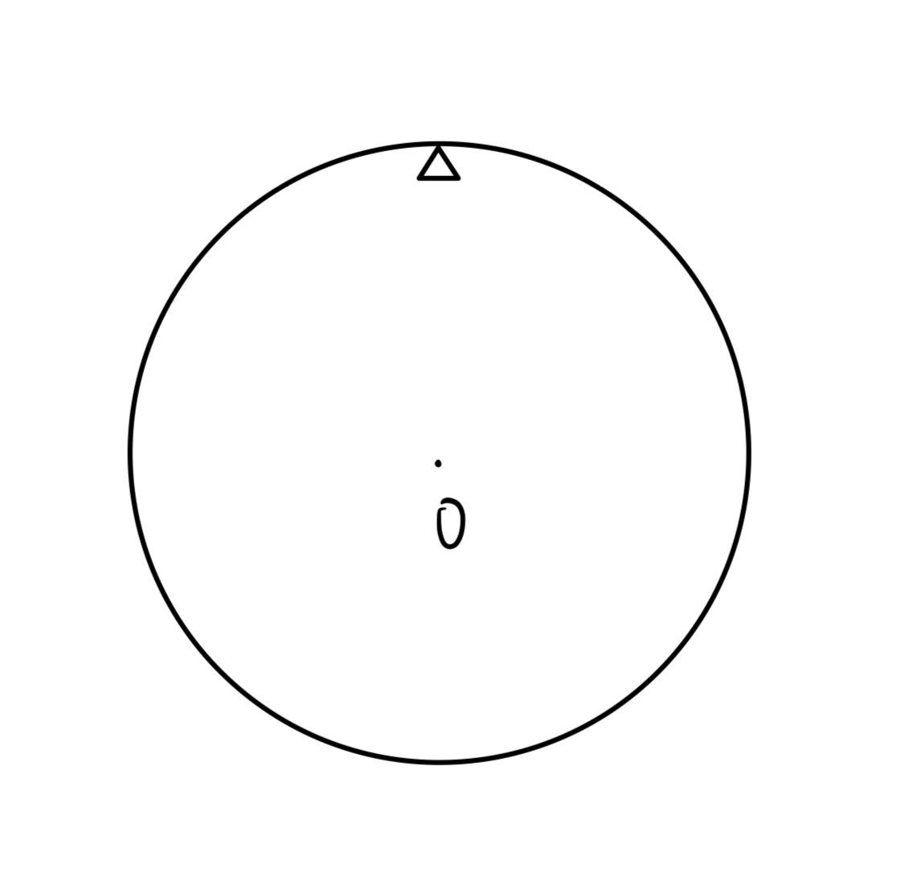
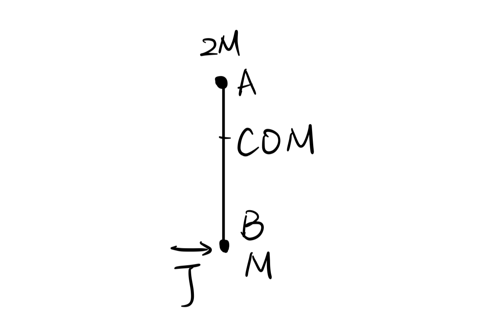
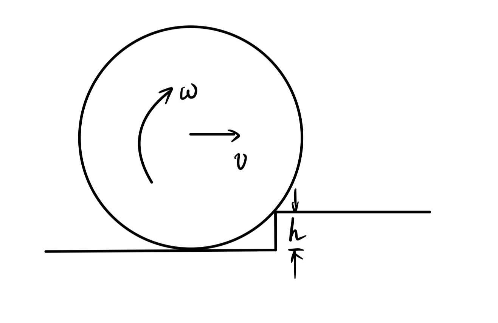
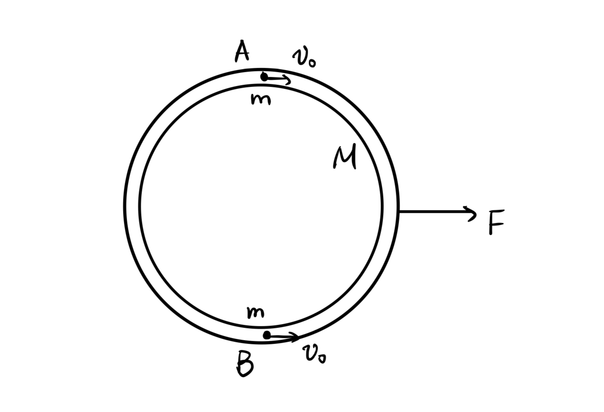
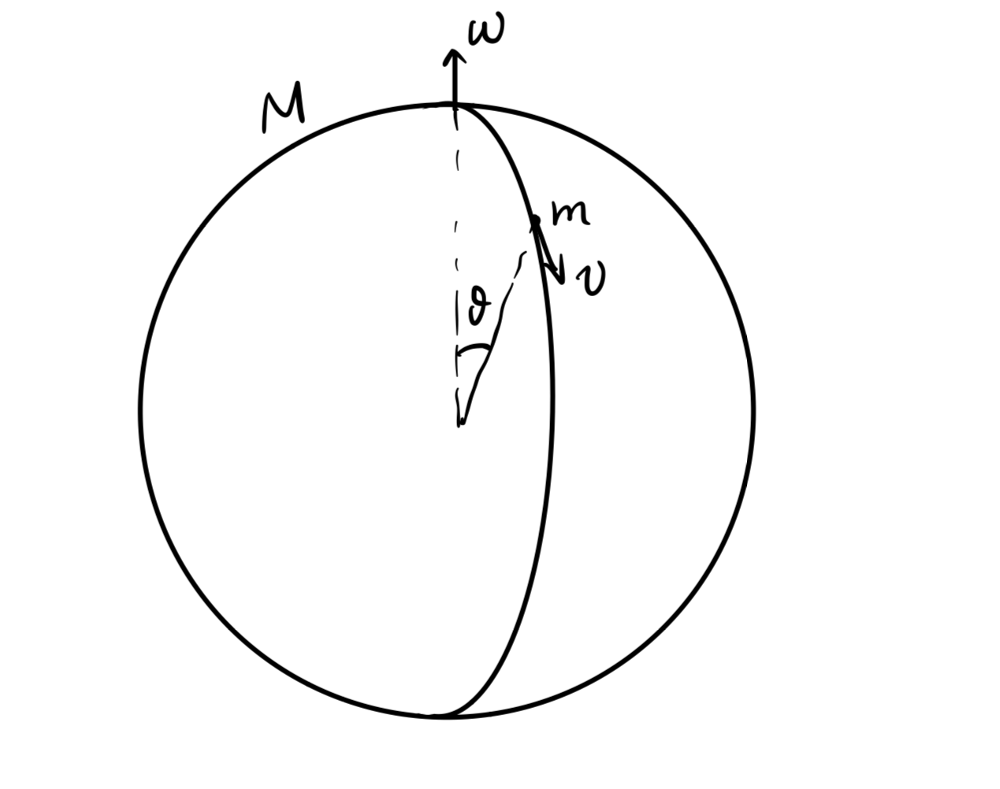
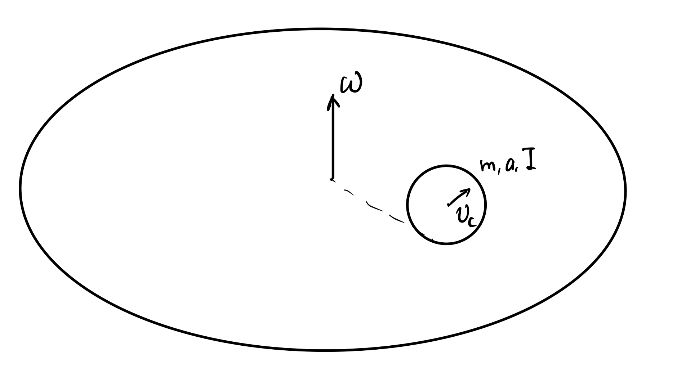

# General Physics: 2026 Spring Midterm

- **Time Limit**: $120$ minutes.
- The total score is $110$ points, including $10$ bonus points.
- No calculators or cheatsheets are allowed.

## Problem 1 ($10+5+5+5+5=30$ pts)

1. For the following three graphs, write down the equations of $x(t)$ and $y(t)$.
    
2. The points $A$ and $B$ lie in the direction of the propagation of a wave, with a distance of $2\mathrm{cm}$ apart. The phase of $B$ lags behind that of $A$ by $\pi/6$. The wavelength is longer than $5\mathrm{cm}$, and the frequency is $10\mathrm{Hz}$. Find the velocity of the wave.
3. An ultrasonic wave with frequency $f=1.5\times10^6\mathrm{Hz}$ is used to measure the velocity of blood flow inside the artery. Suppose the speed of sound inside the blood is $1500\mathrm{m/s}$ and the speed of blood flow is $1\mathrm{m/s}$. The incident direction of the ultrasonic wave is parallel to the direction of the blood flow. Find the frequency shift of the reflected wave from the incident wave.
4. An object is released from rest from a point in the air above Beijing. How will its landing point deviate from the projection of the release point on the ground?
5. Alice is making flutes of different lengths to perform the C major. The frequencies are: $261.6\mathrm{Hz},293.7\mathrm{Hz},329.6\mathrm{Hz},349.2\mathrm{Hz},392.0\mathrm{Hz},440.0\mathrm{Hz},493.9\mathrm{Hz}$. The speed of sound is $340\mathrm{m/s}$. What is the minimum possible length of the longest flute?

## Problem 2 ($5$ pts)

A ring with radius $R$ is hung on the edge of a knife. Find the angular frequency of small oscillations about the hanging point.

## Problem 3 ($5$ pts)

The two balls $A$ and $B$ are connected by a massless rod. Ball $A$ has mass $2M$ and ball $B$ has mass $M$. An impulse $J$ hits ball $B$. Explain why the velocity of ball $A$ is zero the instant after the impulse.

## Problem 4 ($10$ pts)

Initially, a ring with radius $R$ rolls without slipping on the ground with velocity $v$. It hits a step with height $h$ and makes the ascent without slipping.
1. Find the final velocity after the ascent.
2. Find the minimum velocity required to make the ascent.

## Problem 5 ($10$ pts)

A hollow circular tube with mass $M$ has two balls $A$ and $B$ inside it, each with mass $m$. Initially, the tube is at rest, while $A$ and $B$ lie on a diameter with rightward velocity $v_0$. Neglect all friction in the system.
1. Find the relative velocity of $A$ and $B$ just before the first collision.
2. Suppose $v_0=0$ and there is a force $F$ exerted on the tube to the right. Find the relative velocity of $A$ and $B$ just before the first collision in this case.

## Problem 6 ($10$ pts)

A chain of length $L$ and linear density $\lambda$ is initially placed at the edge of a desk, forming a heap. A small perturbation is applied at $t=0$ and chain begins to fall. At any instant the newly moving segment only feels the tension from the fallen part. Find the time $T$ when the chain completely falls off the desk and its final velocity.

## Problem 7 ($10$ pts)

A spaceship is initially orbitting the Sun in the Earth's orbit $r_E$. Now it needs to transfer to the orbit of Mars $r_M$. The transfer is achieved by two instantaneous thrusts at $r_E$ and $r_M$. Find the total velocity change in the process $|\Delta v_1|+|\Delta v_2|$. Denote $\mu=GM_{\mathrm{sun}}$.

## Problem 8 ($10$ pts)

A solid sphere with radius $R$ and mass $M$ initially roates with angular velocity $\omega$. An insect with mass $m$ starts from the north pole and crawls to the south pole along the meridian with constant velocity $v$ (relative to the surface of the sphere). The system does not expereince any force other than those on the axis. Find how much the rotating angle of the sphere is delayed due to the insect.

## Problem 9 ($10$ pts)

A prey $A$ is escaping a predator $B$. Initially $A$ is at point $(0,0)$ and $B$ is at $(L,0)$. $A$ escapes in the $y$ direction with constant velocity $v$. $B$ chases with constant speed $u$ ($u>v$), and the velocity always points in the direction of $A$. Find the total time needed for $B$ to catch $A$.

## Problem 10 ($10$ pts)

A platform is rotating with constant angular velocity $\omega$. A ball with mass $m$, radius $a$ and moment of intertia $I$ moves on the platform without slipping. Prove that no matter what the initial conditions are, the center of the ball always performs a uniform circular motion. Find the angular velocity $\omega_C$ of this motion (not the angular velocity of the ball).
