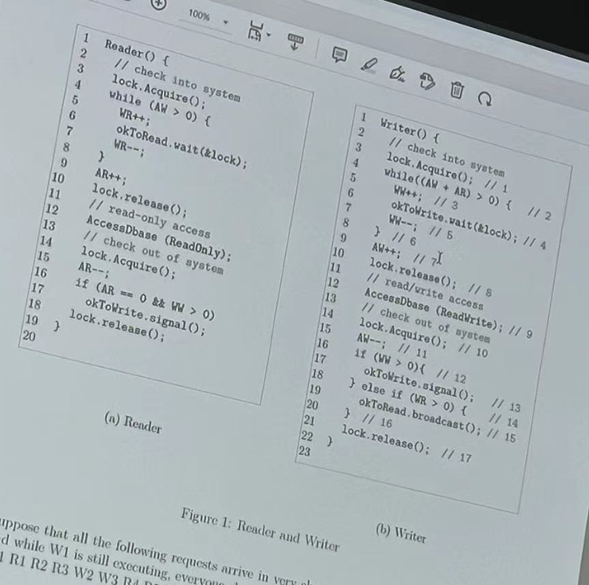

# Intro to Computer Systems: 2024 Spring Midterm
## General Information
- **Date**: 2024-04-19
- **Duration**: In class, but append 5 minutes (9:50 - 12:20)
- **Answer**: In English
- **May Bring Calculators and a one-page A4 cheat sheet.**
- The total score is 110. Any score above 100 will be counted as 100.

*Side Notes*. Most parts of this content is directly copied from the image taken during recitation class. Thus, there may be some incomplete words or sentence. However, I think that the main idea won't change. If you find any problem, please submit an issue.

## Problem 1: True Or False (4pts * 8 = 32 pts)

Indicate whether each of the following statements is true or false. Also, you must explain the reason. An answer without reason will receive no point.

1.  You can always substitute `||` with `|` in C/C++ and still keep correct functionality.
    - ANSWER: False, the first is logical OR and the other is bitwise OR.
2.  With a variable `x` of the type `union {int a[4]; int c;}`, accessing `x.c` will always give you the value of `x. a[0]`, no matter on processors with Big or Little Endian.     
    - ANSWER: True. `a[0]` is always before `a[1]` in memory, `c` and `a[0]` will overlap no matter which endien the system is.
3. If we change your Raspberry Pi to a microcomputer with RISC-V ISA, none of your lab code written in C will work even if you recompile them.
    - ANSWER: False, after recompile they should work except some architecture specific part like NEON.
4. In modern computer systems, there is no way for a thread of a user program to modify any other threads' local variables.
    - ANSWER: False, if you have a pointer you can do whatever you want, as long as the two threads are in the same process, i.e., have the same address space.
5. The only purpose of using multiple threads per process is to accelerate on multicore or hyper-threading computers.
    - ANSWER: False, interleaving for 1/0 waits, or better program
6. Right after the `fork()` `syscall` returns, the child process returns the same states, including memory content and register value.
    - ANSWER: False. The return values (usually in registers) are different.
    
7. Accessing a variable stored in a thread's individual stack is always impossible for other threads.
    - ANSWER :False. Could pass the address of this variable as space.
8. In dining philosophers, deadlock will NOT happen if there is one more chopstick between any two philosophers.
    - ANSWER: True. One of them will finish eventually.


## Problem 2: Short Answer Problems (total 22 pts)

1. Can we construct AND gate using NOR gate? (4 pts)

    - ANSWER: We can implement an AND gate using only NOR gates as follows: Connect both inputs A and A to a NOR gate. This will give us NOT A. Connect both inputs B and B to another NOR gate. This will give us NOT B. 3. Connect NOT A and NOT B to a third NOR gate. This will give us (A AND B).

2. List two reasons why overuse of threads is bad (i.e. using too many threads for different tasks). Be explicit in your answers. (4pts)
    - ANSWER: There are a number of reasons that overuse of threads is bad. Some of them include: (1) The overhead of switching between too many threads can waste processor cycles such that overhead outweighs actual computation (i.e. thrashing). (2) Excessive threading can waste memory for stacks and PCBs (3) The overhead of splitting tasks into threads (the launching/exit process) may not be offset by the resulting gain in performance from parallelism. (4) The synchronization overhead might be huge.

3. What do files a.txt and b.txt contain, after running the following command? `ls -1 | tee a.txt | sed "s/.pdf/dfp/" > b.txt`. Note that `ls -l` outputs the file names in current directory, one file per line. (3pts)

    - ANSWER: `tee` command reads from standard input and writes to both standard out and the file specified by the file name. `sed` command does the replacement here. `a.txt` the file names in the current directory, one file per line. `b.txt` contains the file current directory, with the extension `.pdf` replaced by `dfp`.

4. For the regular expression `^[a-f]\)[a-z]{4}\d?(-[A-2]+)?$`, which line(s) are matched: (5pts)
    ```plaintext
    a)data1-XU 
    b) udata-ABCD
    c)iiis4 
    d)1234-2 
    e)four2-MNOPSER 
    f)code-123
    ```

    - ANSWER: ace
5.  What is the key data structure in the OS kernel, that makes all the processes preempt-able (i.e., the kernel can switch between them)? What information are stored in this data structure? (3pts)
    - ANSWER: PCB. It stores PID, process state (running, ready, waiting...), program counter, CPU registers and so on.
6. Assume a 4-way set-associative cache has 64 kB capacity (1 kB = 1024 B), and the cache block size is 32 bytes. How many bits in the memory address are used for the tag, if the processor is 32-bit? (3pts)
    - ANSWER: There are 512 sets. Offset: log 32 = 5 bits, index: log 512 = 9 bits, tag: 18 bits.


## Problem 3: Architecture

### 3.1 Amdahl's Law and Communication Cost (6 points)
The ideal speedup using parallelization is the number of processors. However, it is limited by two factors: the percentage of the application that can be parallelized, and the cost of communication. Amdahl's law takes into account the former, but not the latter.

1. What is the speedup of an application that is 80% parallelized when using 8 processors if, for every processor added, the communication cost would increase by 0.5% of the original execution time (i.e., the execution time without any parallelization)? (2 points)
    - ANSWER: The speedup is $S=(0.2+0.8/8+8\times 0.005)^{-1}=2.941$. However, since one can say that a single processor will have no communication cost, the following answer is also acceptable: $S=(0.2+0.8/8+7\times 0.005)^{-1}=2.985$.
2. Suppose your server has 32 processors, Would the speedup be maximized if we utilize all the processors? (4 points)       
    - ANSWER: No, more than 12 processors further brings slowdowns.
### 3.2 Cache Organization and Performance (16 points)
You plan to design a 1 kB cache for a processor with 32-bit ISA. The cache uses 32 Byte cachelines, You are discussing with your teammate, Donald, about the design.

1. Donald suggests using a 64-way set associative cache. What do you think of his design? (2 points)
    - ANSWER: The cache only has 1 kB/32 Byte =32 cachelines, so this design is impossible.

2. You find out that Donald has introduced a bug in the cache where the cache tag comparison always yields a mismatch. How would this bug impact (1) the **correctness** of program execution, and (2) the **effective access time** for load/store instructions regardless of correctness? (4 points)
    - ANSWER: The bug would not impact the correctness, since tag mismatches in the cache will always yield a miss and effectively bypass the cache to directly get data from memory. The bug would increase the effective access time, since every access would result in a cache miss.

3. Donald has now partially fixed the previous bug but unfortunately introduced another bug, where the cache randomly reads the valid bit of any cache entry as 0 with a probability of $1-p$. In other words, if a cache entry is actually valid, the cache will think it is valid with probability p; if the cache entry is actually invalid, the cache will correctly think it is invalid, The memory access tine is 40 ns, the cache access time is 10 ns, and we know 90% of the accessed data are actually in the cache (but some other will be recognized as invalid because of the above bug). If the AMAT (average memory access time) under this bug is 41 ns, what is the value of $p$ ? (4 points)  
    - ANSWER: Real cache hit rate =0.9 * p; real cache miss rate =1-0.9 * p; AMAT = 10+miss rate *40 =41; solve the equation, we get p =0.25.

4. Finally, you and Donald have fixed all the bugs, and it is ready to test its performance. Recall that the cache is 1 kB with 32 Byte cachelines, and you eventually use an associativity of 4 ways. You write a simple program that allocates a 2 kB data array and repetitively accesses the array many tines in a stride manner, where the stride s(in Bytes) is a configurable parameter, That is, the program accesses addresses $0, s,2s,3s,...$, and so on, If we start from $s=1$ and double it every time, i.e., $s = 1,2,4,8,...$. Describe how the performance (i.e. AMAT) will change. You do not need to give accurate AMAT values, but need to accurately describe at what s values the AMAT may increase, decrease, or keep the same (6 points)
    - ANSWER: Initially, when s grows from 1 to 32, the AMAT keeps increasing, due to fewer hits per each cacheline. From 32 to 512 (2 kB / 4 ways), the data thrash the cache and are all misses, so the AMAT keeps unchanged, at the highest value. Starting from 512, the data are able to fit in the cache given the 4 ways per set, so the AMAT drops to the lowest (all hits). Note, if students correctly identify there is a range that AMAT icreases/decreases/-keeps but get the begin/end points wrong, give partial points.

### 3.3 Instruction Execution (8 points)

Assume that we are executing the following assembly snippet on a RISC-V 32-bit processor. Here, `a0`, `t0`, `s0`, etc. are just register names, similar to `x0` to `x31` which we discussed in the lecture. The instruction `li` (load immediate) loads the 32-bit immediate value into the destination register.
The instruction `blt` (brauch-if-less-than) branches to the target label if the first source is less than the second source.

```assembly
init:
    li  a0, 0x10000000
    li  a1, 0x100
    li  a2, 0x8
    add s0, x0, a0
    addi t0, x0, 0
L1:
    lw  s1, 0(s0)
    bne s1, a2, L2
    j L3
L2:
    addi s0, s0, 4
    addi t0, t0, 1
    bne t0, a1, L1
L3:
    addi a0, s0, 4
```

1. Rewrite the above assembly code into C/C++. We have provided you the sketch as below. Fill in the blanks (6 points)

```cpp
int *x = 0x10000000;
int s = 0x100;
int a = 0x8;
int *u;
________________________
for (________________________) {
    ________________________{
        ________________________
    }
    ________________________
}
________________________
```

- ANSWER:
    ```cpp
    u = x;
    for (int i = 0; i != 0x100; ++i){
        if (*u == a) {
            break;
        }
        u += 1;
    }
    x = u + 1;
    ```

2. Use natural language (English) to describe the functionality of this code, as briefly as possible (2 points).
    - ANSWER: Find an element in an array whose value equals to the given value, and make the pointer points to the element after this.

## Problem 4: Scheduling (9 pts)

Assume that:
- All timeslice-based algorithm has a timeslice of 1 unit.
- The current running thread is not in the ready queue while it is running.
- An arriving thread is run at the beginning of its arrival time if the scheduling policy allows it.

Fill in blanks in the following table (including the question marks):

| Current Time | FCFS | ? | ? | 
|--------------|------|---|---|
| 1            | A   |  A | A  |
| 2            | A   |  B |  B |
| 3            | A   |  B |  A |
| 4            | A   |   |   |
| 5            | B   |   |   |
| 6            | B   |   |   |
| 7            | C   |   |   |
| 8            | D   |   |   |
| 9            | D  |   |   |
| 10            | D  |   |   |
| Average Turnaround Time | 4.25 |  |  |

The turnaround time is defined as the time difference between the completion time and the arrival time of a process. 

The possiblities are SRTF, RR and SJF. You can resolve any ties using FCFS.

Hint: you MUST first fill in the **entry time** table below.

| Process | Arrival Time |
|---------|--------------|
| A       | 1            |
| B       | 2            |
| C       | ?            |
| D       | 8            |

- ANSWER: entry time of C is 3. The filled table is shown below:

    | Current Time | FCFS | SRTF | RR | 
    |--------------|------|---|---|
    | 1            | A   |  A | A  |
    | 2            | A   |  B |  B |
    | 3            | A   |  B |  A |
    | 4            | A   |  C |  C |
    | 5            | B   |   A|   B|
    | 6            | B   |  A |   A|
    | 7            | C   |  A |   A|
    | 8            | D   |  D |   D|
    | 9            | D  |   D|   D|
    | 10            | D  |  D |  D |
    | Average Turnaround Time | 4.25 | 3.5 | 4 |
        

## Problem 5: Synchronization (23 pts)
### 5.1 Reader + Writer (8 Points)
We show the original Readers-Writers example given in the lecture in Figure below. It uses two condition variables, one for waiting readers and one for waiting writers. Variables are defined the same as in the lecture.



Suppose that all the following requests arrive in very short time period. `W1` came in first and while `W1` is still executing, everyone else comes in at the same time. Incoming stream: `W1 R1 R2 R3 W2 W3 R4 R5 R6 W4 R7 W5 W6 R8 R9 W7 R10`

1. Modify the code to implement "polite writers", that always give priority to readers. List the lines (lines in the comments in the writer code) you want to modify and give the modified version.

    - ANSWER: First check whether there are any waiting readers. If there are, then `broadcast`. Then `signal` a waiting writer.

2. In what order would your modified "polite writer" code process the above requests? You can assume that the wait queues for condition variables are FCFS. Explain how you got your answer, You can use notations like `{R1, R2}` to indicate that they are concurrent.
    - ANSWER: The order would be: `W1, {R1 R2 R3 R4 R5 R6 R7 R8 R9 R10}, W2, W3 , W4 , W5 , W6, W7`

3. Why is this version worse than the original version in the lecture, in general cases?
    - ANSWER: This version gives priority to the reader, making it better for read-critical situations but worse for write-critical ones, There might be starvation for writers.

4. Give a specific use case where the polite writer version could be better.
    - ANSWER: where writes are not in a hurry, the writes / modification could be done at night, etc.

### 5.2 Producer/Consumer: Task Queue for Synchronization (15 pts)

Consider the following synchronized task queue, using a simple queue (`Queue`) and a monitor (`Lock` and `Condition`)

```cpp
class SyncQueue{
    private: 
        Lock lock_;
        ConditionVariable cv_;
        Queue q_;
    public: 
        void Init(int length){
            lock_.Init();
            cv_.Init();
            q_.Init(length);
        }
        void AddToQueue(void* item){
            lock_.Acquire();
            q_.enqueue(item);
            cv_.Signal();
            lock_.Release();
        }
        void* RemoveFromQueue(){
            lock_.Acquire();
            while(q_.empty()){
                cv_.Wait(&lock_);
            }
            void* item = q_.dequeue();
            lock_.Release();
            return item;
        }
}tq;
```

1. Consider the following implementation of producer and consumer:

```cpp
//Running in multiple producer threads
void Produce(){
    while(true){
        void* item = produce_item();
        //wait if needed
        tq.AddToQueue(item);
    }
}
//Running in multiple consumer threads
void Consume(){
    while(true){
        //wait if needed
        void* item = tq.RemoveFromQueue();
        consume_item(item);
    }
}
```
Give an example where the code will fail. You can assume that there are multiple producers and consumers, and the `Init` has no bugs.

- ANSWER (brief): the queue has an upper limit `length`. Thus, the code will fail if there are too many producers.

2. Briefly discuss a possible solution (general idea without code is sufficient).

- ANSWER (brief): Add another control variable to indicate whether the queue is full.

3. After fixing the queue implementation, please use the queue to implement a semaphore. Recall that a semaphore is defined in the interface in Figure. Please implement the three functions (including definition of `struct sem_t`) using the queue interface above (`TaskQueue` and its member functions), (A little difference from the original semaphore is allowed, see the next sub-question.)
```cpp
typedef struct sem_t{
    TaskQueue tq_;
}sem_t;
void init(sem_t* sem, unsigned int value){

}
void R(sem_t* sem){
}
void V(sem_t* sem){
}
```

- ANSWER:
```cpp
typedef struct sem_t{
    TaskQueue tq_;
}sem_t;
void init(sem_t* sem, unsigned int value){
    sem->tq_.Init(value);
    for(unsigned int i=0;i<value;i++){
        sem->tq_.AddToQueue(NULL);
    }
}
void R(sem_t* sem){
    sem->tq_.RemoveFromQueue();
}
void V(sem_t* sem){
    sem->tq_.AddToQueue(NULL);
}
```

4. What's the *semantic* difference between your implementation of the semaphore and the semaphore defined in class? The word *semantic* means that you may not say about the implementation/performance differences.

    - ANSWER: My semaphore has a limitation: its value can't be higher than the initial value, which is set based on the queue size.
    
        This aligns with the semaphore behavior discussed in class if the initial value is always greater than or equal to all possible values encountered during execution. However, if the value can exceed the initial value, my implementation will block on V and potentially lead to deadlock.