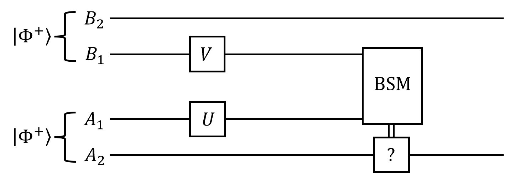

# Quantum CC 2025 Fall Midterm

**Date:** November 11, 2025 (Tuesday).

**Time:** 13:30 PM - 16:20 PM (15 minutes extended from original schedule).

**Format:** Closed book. No cheatsheets allowed. Calculators are "not needed".

**Total Points:** 110 points (including 10 bonus points).

**Materials Covered:** Chapters 0 (Basic Math and Information Theory), 1 (Single-Party Quantum Systems), 2 (Bipartite Quantum Systems), 3 (Applications on Multiparty Quantum Systems), 4 (Quantum Information Theory), and 8 (Coherence and QRNG) of the Lecture Notes.

## Problem 1. Bloch Sphere (10 points)

Consider single-qubit states $\rho_1 = \frac 12 \ket{0} \bra{0} + \frac12 \ket{+} \bra{+}$ and $\rho_2 = \frac23 \ket{0} \bra{0} + \frac13 \ket{1} \bra{1}$.

(a) (5 points) Calculate their Purities, $\mathrm{tr}(\rho_1^2)$ and $\mathrm{tr}(\rho_2^2)$.

(b) (5 points) Find their Bloch sphere representations. That is, find the bloch vectors $\vec{r}_1$ and $\vec{r}_2$ of the states.

## Problem 2. Purification of Mixed State and Measurement (15 points)

Consider single-qubit mixed state $\rho = \frac23 \ket{0} \bra{0} + \frac13 \ket{+} \bra{+}$.

(a) (5 points) Find a two-qubit purification of the state $\rho$.

(b) (5 points) Calculate the Von Neumann entropy of the state, $S(\rho)$.

(c) (5 points) Suppose a PVM onto the basis $\ket{\pm \theta} = \frac{1}{\sqrt{2}} (\ket{0} \pm e^{i\theta} \ket{1})$ is performed on the state, and the measurement result is lost. Calculate the post-measurement state $\rho'$.

## Problem 3. Purification of Quantum Channel (5 points)

Find a two-qubit Stinespring Dilation $U$ for channel

$$
C(\rho) = \frac12 \rho + \frac12 Z \rho Z,
$$

where $Z$ is the single-qubit Pauli-Z gate.

## Problem 4. Coherence and QRNG (15 points)

(a) (5 points) Alice uses a quantum random number generator that first generates a quantum state, then performs a computational basis measurement, and outputs the measurement result as a random number. The adversary Eve, however, wants to predict the random number Alice receives. Consider two scenarios for the quantum states produced by the device:

1. $\ket{+}$,
2. $\frac12 \left(\ket{0} \bra{0} + \ket{1} \bra{1}\right)$.

In which case can Eve predict the random number in principle, and how would Eve accomplish this?

(b) (5 points) The decoherence channel, $\Delta$, is defined as

$$
\Delta(\rho) = \sum_i \ket{i} \bra{i} \rho \ket{i} \bra{i},
$$

where $\{\ket{i}\}$ is the computational basis. Show that a state $\rho$ is incoherent if and only if $\Delta(\rho) = \rho$.

(c) (5 points) A commonly used coherence measure is the relative entropy of coherence, defined as

$$
C_{\mathrm{rel}}(\rho) = \min_{\sigma \in \mathcal{I}} S(\rho || \sigma),
$$

where S($\rho || \sigma$) is the quantum relative entropy, and $\mathcal{I}$ is the set of incoherent states. Prove that

$$
C_{\mathrm{rel}}(\rho) = S(\Delta(\rho)) - S(\rho).
$$

## Problem 5. Quantum Noiseless Coding (10 points)

Suppose Alice prepares the states $\ket{\pm \theta} = \cos \theta \ket{0} \pm \sin \theta \ket{1}$ $\left(0 \leq \theta \leq \frac \pi 4\right)$ with equal probabilities and sends them to Bob through a noiseless quantum channel. Bob measures it in the computational basis to get a classical bit. Let 

$$
\rho = \frac12 \ket{+\theta} \bra{+\theta} + \frac12 \ket{-\theta} \bra{-\theta}
$$

be the density matrix of the states sent to Bob. Now suppose $L$ qubits are sent from Alice to Bob. Let the random variable $X$ denote the classical bits Bob gets from measuring the $L$ qubits.

(a) (5 points) Find the probability distribution of $X$.

(b) (5 points) In the asymptotic limit $L \to \infty$, identify the typical space of $X$, and give an upper bound on the size of the typical space. Show that the data compression rate $R$ in this case coincides with the result of the Noiseless Coding Theorem for pure states, that is, $R = S(\rho)$.

## Problem 6. Trace Distance (10 points)

A commonly used distance measure between two quantum states $\rho$ and $\sigma$ is the trace distance defined as

$$
D(\rho, \sigma) = \frac12 \|\rho - \sigma\|_1,
$$

where $\|A\|_1$ is the trace norm of operator $A$.

(a) (5 points) For two single-qubit pure states with Bloch representations $\rho = \frac12 (I + \vec{r} \cdot \vec{\sigma})$ and $\sigma = \frac12 (I + \vec{s} \cdot \vec{\sigma})$, show that

$$
\|\rho - \sigma\|_1 = \|\vec{r} - \vec{s}\|_2,
$$

where $\|\vec{r}-\vec{s}\|_2$ is the Euclidean norm of vector $\vec{r}-\vec{s}$.

(b) (5 points) Show that for two (not necessarily single-qubit) quantum states $\rho$ and $\sigma$,

$$
D(\rho, \sigma) = \max_{0 \leq \Lambda \leq I} \mathrm{tr} \left(\Lambda(\rho - \sigma)\right),
$$

where the maximization is over all positive operators $\Lambda$ bounded by the identity operator $I$.

**Note:** (This did not appear in the exam paper, but is clarified by the instructor during the exam.) The expression $0 \leq \Lambda \leq I$ means that both $\Lambda$ and $I - \Lambda$ are positive semidefinite operators.

## Problem 7. Tripartite Game (10 points)

Alice, Bob, and Charlie are invited to play the following tripartite game. They are each given a random bit, $x$, $y$, and $z$, respectively, and they are asked to output bits $a$, $b$, and $c$, respectively. The input bits $(x,y,z)$ are chosen uniformly at random from the set $\{(0,0,0), (0,1,1), (1,0,1), (1,1,0)\}$.
They may agree on a strategy before the game starts, but they cannot communicate once the game begins. They win the game if

$$
a \oplus b \oplus c = x \vee y \vee z,
$$

where $\oplus$ is addition modulo 2, and $\vee$ is the logical OR operation. Notice that whatever strategy they choose (quantum or classical), the strategy must satisfy the no-signaling condition, that is, the marginal distribution of one player's output cannot depend on the input bits of the other players.

(a) (5 points) Derive the maximal winning probability if they use a classical strategy.

(b) (5 points) Suppose they share a tripartite state

$$
\ket{\psi}_{ABC} = \frac{1}{2} (\ket{000} - \ket{011} - \ket{101} - \ket{110}).
$$

During the game, each player measures their qubit in the $Z$ basis if their input bit is 0, and in the $X$ basis if their input bit is 1. Show that using this strategy, they can win the game with certainty.

## Problem 8. Strong Subadditivity and Data Processing (15 points)

The strong subadditivity (SSA) of Von Neumann entropy states that for any tripartite quantum state $\rho_{ABC}$,

$$
S(ABC)_\rho + S(B)_\rho \leq S(AB)_\rho + S(BC)_\rho,
$$

where $S(\cdot)_\rho$ is the Von Neumann entropy of the corresponding reduced state of $\rho_{ABC}$.

(a) (5 points) The conditional quantum mutual information is defined as

$$
I(A:B|C)_\rho = S(A|C)_\rho + S(B|C)_\rho - S(AB|C)_\rho ,
$$

where $S(\cdot|C)_\rho$ is the conditional Von Neumann entropy. Show that SSA is equivalent to the non-negativity of the conditional quantum mutual information.

(b) (5 points) Consider $\mathcal{E}: B \to C$ be a quantum channel. Suppose $\rho_{AB}$ is a bipartite quantum state, and let $\sigma_{AC} = (I_A \otimes \mathcal{E})(\rho_{AB})$ be the state after applying the channel $\mathcal{E}$ on system $B$. Use SSA to show the data processing inequality for quantum mutual information, that is,

$$
I(A:B)_\rho \geq I(A:C)_\sigma.
$$

(c) (5 points) Use the Data Processing Inequality to prove the SSA. **Tips:** Consider $\rho = \rho_{ABC}$ and $\sigma = \rho_A \otimes \rho_{BC}$.

## Problem 9. Entanglement Swapping and Gate Teleportation (10 points)

Alice and Bob wish to perform the entanglement swapping protocol. They both possess a Bell pair, $\ket{\Phi^+}_{A_1 A_2}$ and $\ket{\Phi^+}_{B_1 B_2}$, respectively. They send one of their qubits, $A_1$ and $B_1$, to Charlie, who performs a Bell State Measurement on the two qubits and sends the measurement result to Alice. Depending on the measurement result, Alice performs a local unitary operation on her qubit $A_2$, to recover a Bell pair, $\ket{\Phi^+}_{A_2 B_2}$, between $A_2$ and $B_2$.

Now suppose that some known local unitary errors $U$ and $V$ occur on the qubits $A_1$ and $B_1$, respectively, before they reach Charlie. The full procedure with errors is illustrated in Figure 9.1.

*Figure 9.1: Entanglement swapping with local errors. "BSM" stands for Bell State Measurement.*

(a) (5 points) For each of the four Bell measurement outcomes Charlie may obtain, find the corresponding local unitary operation Alice should perform on her qubit $A_2$ to recover the Bell pair $\ket{\Phi^+}_{A_2 B_2}$.

(b) (5 points) Suppose instead of perfect Bell pairs, the Bell pairs Alice and Bob possess is noisy and may be described by the density matrix

$$
\rho_{A_1 A_2} = \rho_{B_1 B_2} = (1-p) \ket{\Phi^+} \bra{\Phi^+} + p \frac{I}{4},
$$

where $0 < p < 1$. In this case, to maximize the fidelity between the final state of $A_2 B_2$ and the ideal Bell pair $\ket{\Phi^+}_{A_2 B_2}$, what operations should Alice perform on $A_2$, for each measurement outcome of Charlie? What is the corresponding maximal fidelity?

## Problem 10. Quantum Encoding and Holevo Bound (10 points)

Alice and Bob share a bipartite quantum state $\rho^{AB}$, where $A$ is a qudit (d-dimensional) system and $B$ is an arbitrary system. Alice wants to send some classical information to Bob by performing a quantum encoding on her system $A$. She chooses the classical message $x$ with probability $p_x$, and performs a quantum channel $\mathcal{E}_x$ on system $A$ accordingly. She then sends system $A$ to Bob through a noiseless quantum channel. After receiving system $A$, Bob performs a measurement to decode the classical message. By the Holevo bound, the mutual information between Alice's classical message $X$ and Bob's measurement result $Y$ is upper bounded by the Holevo information,

$$
I(X:Y) \leq \chi(\mathcal{E}) \equiv S\left(\sum_x p_x \mathcal{E}_x^A \otimes I^B(\rho^{AB})\right) - \sum_x p_x S\left(\mathcal{E}_x^A \otimes I^B(\rho^{AB})\right).
$$

(a) (5 points) Show that the Holevo information $\chi(\mathcal{E})$ is upper bounded by

$$
\chi(\mathcal{E}) \leq \log d + \sup_{\mathcal{E^A}} F^B((\mathcal{E}^A \otimes I^B)(\rho^{AB})),
$$

where the supremum is over all quantum channels $\mathcal{E}^A$ acting on system $A$, and the function $F^B$ is defined as

$$
F^B(\rho^{AB}) = \max\left\{0, S(\mathrm{tr}_A(\rho^{AB})) - S(\rho^{AB})\right\}.
$$

**Tips:** Apply the subadditivity of Von Neumann entropy.

(b) (5 points) Show that the upper bound in (a) is achievable.

**Tips:** There exists a set of $d^2$ unitary operators $\{U_x^A\}$ acting on system $A$, such that for any state $\rho^{AB}$,

$$
\frac{1}{d^2} \sum_x U_x^A \rho^{AB} U_x^{A \dagger} = \frac{I^A}{d} \otimes \rho^B.
$$